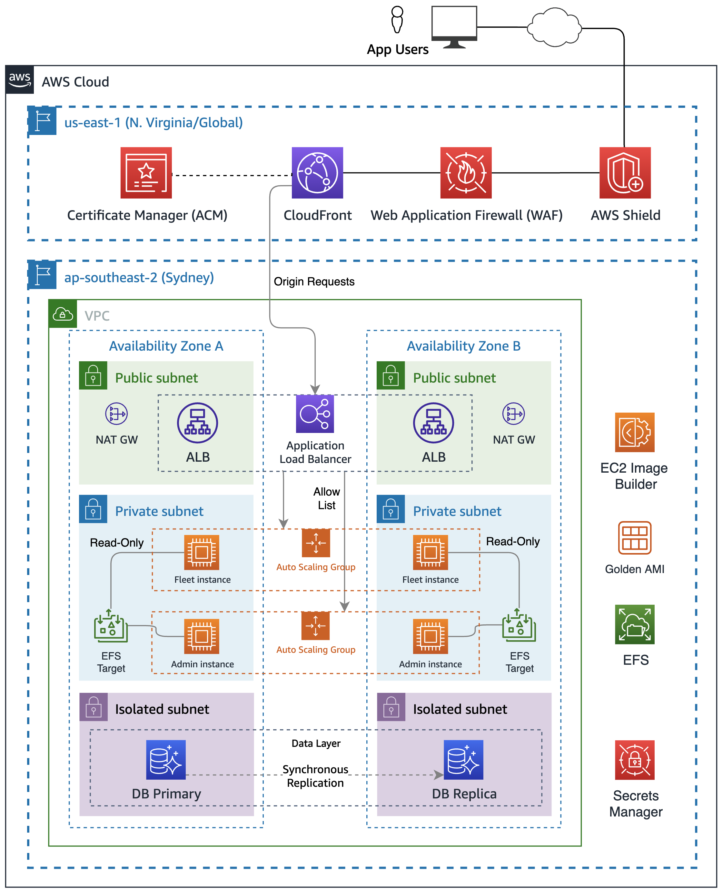

# Running Web-Administered Apps on AWS

## With multi-layered security and high availability 

This CDK+Python project is designed to support the web administered app model (eg [WordPress](https://wordpress.org), [Node-RED](https://nodered.org/)), where the admin interface is hosted within the same codebase as the front-end application. 

To achieve this outcome more securely, this project creates two groups of server hosts - one with admin access and one with only read access. This enables you to restrict all write operations to a server (or servers) that can only be accessed from specific allowed IP addresses.

All the needed component layers (Network, Database, Compute, Load Balancing and CDN layers) for a secure and scalable web app solution on AWS are included.

The solution is built around shared storage, provided by [Amazon Elastic File System (EFS)](https://aws.amazon.com/efs/). All the [compute (EC2) instances](https://aws.amazon.com/ec2/) mount this file system and use it to share the app code and other content required to make the app work.

For the database layer, you can either create a new database on the [Amazon Relational Database Service (RDS)](https://aws.amazon.com/rds/), or you can bring an RDS snapshot and its [Secrets Manager](https://aws.amazon.com/secrets-manager/)-hosted credentials. If you have an existing database host, you can also supply your credentials for that in a Secrets Manager secret.


## Solution details

This solution includes two [Autoscaling Groups (ASGs)](https://docs.aws.amazon.com/autoscaling/ec2/userguide/what-is-amazon-ec2-auto-scaling.html) of EC2 instances - one to serve your site to the public and one to allow administration of it. Both are fronted by a single [Application Load Balancer (ALB)](https://aws.amazon.com/elasticloadbalancing/application-load-balancer/) that has rules configured to conditionally direct traffic to the different [ALB Target Groups](https://docs.aws.amazon.com/elasticloadbalancing/latest/application/load-balancer-target-groups.html). 



[Amazon CloudFront](https://aws.amazon.com/cloudfront/) is configured to be the entry point for all traffic, and it is configured to use [AWS Web Application Firewall (WAF)](https://aws.amazon.com/waf/) with AWS Managed rules designed to block common types of malicious traffic (eg XSS and database injection).

Data in-transit is encrypted through the use of [AWS Certificate Manager (ACM)](https://aws.amazon.com/certificate-manager/) certificates. This project leverages [Amazon Route 53](https://aws.amazon.com/route53/) to manage the creation of DNS names and the certificates required to securely access your application.

You can specify the AMI to be used in your application stack, which means you can leverage [EC2 Image Builder](https://aws.amazon.com/image-builder/) to pre-configure AMIs with needed software. If you don't need to do that, you can simply supply [userdata](https://docs.aws.amazon.com/AWSEC2/latest/UserGuide/user-data.html) scripts or commands that will configure the instance before bringing it into service.

## Configuration

To enable this project to be used to deploy multiple different web projects, all configuration is done in the `parameters.properties` file. The configuration items are named and annotated with comments that explain their function.

The `[default]` stanza sets the default app name and environment that will be deployed if you don't specify them on the command line.

The remaining stanzas are all named by combining valid `app` and `env` values, eg `<app>-<env>`. So if you want to support three different WordPress deployments (for instance) you might specify that app name as `wp` and for env you might want `dev`, `test` and `prod` giving you three stanzas `wp-dev`, `wp-test` and `wp-prod`. Each stanza can specify its own regions, accounts, instance types, instance counts, hostnames etc.

To deploy a specific stanza's config, issue a deploy command using the appropriately matching stack name and context variables, eg:

```
$ cdk deploy wp-dev-network-stack -c env=dev -c app=wp
```

## Prerequisites

### Install the AWS CDK

Refer to the instructions near the bottom of this README to see instructions about installing CDK and running this CDK project.

### CDK Bootstrapping

You will need to [bootstrap](https://docs.aws.amazon.com/cdk/v2/guide/bootstrapping.html) both the `us-east-1` Region and the home region you plan to host your application into, eg

```
cdk bootstrap aws://123456789012/us-east-1
cdk bootstrap aws://123456789012/ap-southeast-2
```

where `123456789012` is replaced with your account ID and `ap-southeast-2` is replaced with your primary Region.

### Create a hosted zone in the target account

This is needed to enable the creation of DNS records and certificates for your site. This needs to be manually created via the AWS console and can be achieved by following [the instructions here](https://docs.aws.amazon.com/Route53/latest/DeveloperGuide/CreatingHostedZone.html). You can delegate any domain you control to Route 53 and use it with this project. You can also [register a domain via Route 53](https://docs.aws.amazon.com/Route53/latest/DeveloperGuide/domain-register.html) if you don't currently have one.

## Running this project

Clone the project to your local machine and navigate to the project root. Follow the steps in the [Generic CDK instructions](#generic-cdk-instructions) to create the Python virtual environment (`venv`) and install the dependencies.

### Create and configure the parameters.properties file

Copy the `parameters-template.properties` file (in the root folder of the project) to a file called `parameters.properties` and save it in the root folder. Open it with a text editor and 

* replace `example.com` with the name of the hosted zone you created in the previous step.
* replace `192.0.2.0` with your admin IP address (usually [the public IP of the computer you are using now](https://www.google.com/search?q=whats+my+ip)).

If you want to restrict public access to your site, change `192.0.2.0/24` to the IP range you want to allow (don't forget to also include your admin IP in CIDR notation (ie include the netmask, as in the example)). You can add multiple allowed CIDR blocks by providing a comma-separated list of `allowedIps`. 

If you don't want to restrict public access, set `allowedIps=*` instead.

>If you have forked this project into your own private repository, you can commit the `parameters.properties` file to your repo. To do that, comment out the line in the `.gitignore` file. 

### Install the custom resource helper

A [CloudFormation Custom Resource](https://docs.aws.amazon.com/AWSCloudFormation/latest/UserGuide/template-custom-resources.html) is used to do cross-region configuration management. You will need to run the following command in the custom_resource directory to install the needed python package:

```
cd custom_resource
pip install crhelper -t .
```

You can read more about this solution in [this blog post](https://aws.amazon.com/blogs/infrastructure-and-automation/aws-cloudformation-custom-resource-creation-with-python-aws-lambda-and-crhelper/).

### Configure the Database layer

Before you start deploying stacks, decide whether you want to include a data layer as part of this deployment or not. The `dbConfig` parameter determines what will happen.

If `dbConfig` is:

* left empty - no database will be created and no db credentials will be available in your compute stacks
* set to `instance` - you will get a new RDS instance
* set to `cluster` - you will get an Aurora RDS cluster
* set to `none` - any previously-created database will be deleted

If you specify either `instance` or `cluster` you should also configure the other database parameters to match your requirements:

* `dbEngine` - set the database engine to either `mysql` or `postgres`
* `dbSnapshot` - specify the named snapshot for your database
* `dbSecret` - if using an existing database, the ARN of the secret where the database credentials and DNS endpoint can be found (see below)
* `dbMajorVersion` the major version of the engine you have chosen - leave blank to get the default version
* `dbFullVersion` the minor version of the engine you have chosen - leave blank to get the default version
* `dbInstanceType` the instance type you want (NB these vary by service) - don't prefix with `db.` as CDK will automatically prepend it.
* if requesting a cluster, `dbClusterSize` will determine how many Aurora replicas are created

You can choose between `mysql` or `postgres` for the database engine, and the other settings will be determined by that choice.

Note you will need to use an AMI that has the CLI pre-installed, like Amazon Linux 2, or install the AWS CLI yourself with a user data command
If instead of creating a new empty database you want to spin one up from a snapshot, you can supply the snapshot name via the dbSnapshot parameter.

#### Database secret

If you create an RDS instance or Aurora cluster as part of this deployment the secret will be created and managed for you.

When you choose to create a new database instance or cluster, credentials are automatically created. These credentials are stored in a Secrets Manager secret and made available to your Compute stack via the `db_secret_command` that can be interpolated into your user data commands. It is a single-line bash command that returns the JSON from the AWS CLI command `aws secretsmanager get-secret-value`. 

Your script can then reference these values like this:

```
SECRET=$({db_secret_command})
USERNAME=`echo $SECRET | jq -r '.username'`
PASSWORD=`echo $SECRET | jq -r '.password'`
DBNAME=`echo $SECRET | jq -r '.dbname'`
HOST=`echo $SECRET | jq -r '.host'`
```

If you are creating a database from a snapshot, make sure your Secrets Manager secret and RDS Snapshot are in the target region. 

If supplying the secret for an existing database, the secret must be contain at least the following four key-value pairs:

```
{
    "password":"<password>",
    "dbname":"wordpress",
    "host":"hostname.rds.amazonaws.com",
    "username":"admin"
}
```

> The name for the secret must match the following template - the `app` value followed by the `env` value (both in Pascal case), followed by "DatabaseSecret" and whatever other characters you like. Eg for app=wp and env=dev your secret name should be `WpDevDatabaseSecret-optionalstuffhere`


## Deploying the stacks

The commands to deploy the stacks defined in the CDK app are listed below. You can deploy them all individually if you like, by using the specific stack names (these will vary as per the info above), eg:

```
cdk deploy wp-dev-network-stack -c app=wp -c env=dev
cdk deploy wp-dev-database-stack -c app=wp -c env=dev
cdk deploy wp-dev-compute-stack -c app=wp -c env=dev
cdk deploy wp-dev-cdn-stack -c app=wp -c env=dev
```

If you are creating a database stack, you will need to deploy the Network and Database stacks first:

```
cdk deploy wp-dev-network-stack -c app=wp -c env=dev
cdk deploy wp-dev-database-stack -c app=wp -c env=dev
```

You can then trigger the deployment of the compute stack by deploying:

```
cdk deploy wp-dev-compute-stack -c app=wp -c env=dev
```

Once the compute stack is deployed you will be able to 

```
cdk deploy wp-dev-cdn-stack -c env=dev
```

This one will deploy the global CDN infrastructure to the `us-east-1` region.

All the stacks are deployed to the region you specified in your config stanza, apart from the CDN stack, which is deployed to the Global region. 

### Testing the results

Assuming all your stacks deploy as expected, your site will appear at either `subdomain`.`hostedZone` (if you specified a value for `subdomain`) or `appName`-`env`.`hostedZone` (if you didn't), eg `www.example.com` or `wp-dev.example.com`.

If you connect via the IP address you configured in the `adminIps` configuration, you should be connected to the `admin` instance for your site. The admin instances can modify the filesystem so they are where you should do your administration tasks.

Users who connect to your site from an IP not in your `allowedIps` list will be connected to your `fleet` instances and will be unable to alter the filesystem (eg install plugins, upload media etc).

> If you find you need to re-deploy the same app-env combination, manually remove the parameter store items and the replicated Secret created in `us-east-1`. You should also delete the `cdk.context.json` file, as it caches values you will be replacing.

## About the example configurations

The properties file supplied with this project has configurations that will deploy [WordPress](https://wordpress.org) and [Node-RED](https://nodered.org/).

You can use these configurations as-is to deploy your own WordPress or Node-RED instances, or you can create your own config stanzas for other applications, including bespoke applications you have created.

### About the WordPress example

If you try to access `wp-admin` from an IP not in the `adminIps` list, you should see the following response:

> ## Forbidden
> You don't have permission to access this resource.

### About the Node-RED example

As this is a Node.js app, the fleet instances need to respond to changes to the `flows` files, so `nodemon` is used to watch the EFS mount and reload Node-RED when there are changes.

## To Cleanup

If you deploy this CDK app, but then decide it's not for you, a simple 

```
cdk destroy wp-dev-database-stack -c env=dev -c app=wp
```

(if you created the db stack) followed by

```
cdk destroy wp-dev-network-stack -c env=dev -c app=wp
```

(customised with your env and app names) should destroy all the stacks and everything in them, except for the parameter store items and the replicated Secret that were created in `us-east-1` - you will need to remove those manually.

## Generic CDK instructions

This is a project built using CDK with Python. Install CDK by using the instructions here: https://docs.aws.amazon.com/cdk/v2/guide/getting_started.html - be sure to choose the Python instructions.

The `cdk.json` file tells the CDK Toolkit how to execute your app.

This project is set up like a standard Python project.  The initialization process also creates a virtualenv within this project, stored under the `.venv` directory.  To create the virtualenv it assumes that there is a `python3` (or `python` for Windows) executable in your path with access to the `venv` package. If for any reason the automatic creation of the virtualenv fails, you can create the virtualenv manually.

To manually create a virtualenv on MacOS and Linux:

```
$ python3 -m venv .venv
```

After the init process completes and the virtualenv is created, you can use the following step to activate your virtualenv.

```
$ source .venv/bin/activate
```

If you are a Windows platform, you would activate the virtualenv like this:

```
% .venv\Scripts\activate.bat
```

Once the virtualenv is activated, you can install the required dependencies.

```
$ pip install -r requirements.txt
```

At this point you can now synthesize the CloudFormation template for this code.

```
$ cdk synth
```

To add additional dependencies, for example other CDK libraries, just add them to your `setup.py` file and rerun the `pip install -r requirements.txt` command.

## Useful commands

 * `cdk ls`          list all stacks in the app
 * `cdk synth`       emits the synthesized CloudFormation template
 * `cdk deploy`      deploy this stack to your default AWS account/region
 * `cdk diff`        compare deployed stack with current state
 * `cdk docs`        open CDK documentation

Enjoy!
